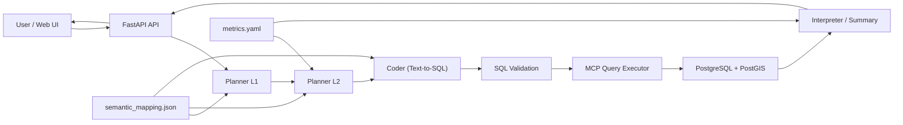

# Semantic NLQ Engine

정형 데이터를 자연어로 질의하되, LLM이 데이터베이스를 직접 건드리지 못하도록 분리하고, 시맨틱 레이어로 SQL 생성 범위를 통제하는 NLQ 분석 엔진 PoC입니다.

행정/인구 데이터 시나리오를 예시 도메인으로 사용했지만, 구조 자체는 다른 SQL 기반 분석 도메인으로 이식할 수 있도록 설계했습니다.

## 프로젝트 한 줄 요약

> "자연어 질의는 유연하게 받고, 데이터 접근은 엄격하게 통제하는" 시맨틱 기반 분석 시스템을 구현한 프로젝트입니다.

## 이 프로젝트가 푸는 문제

일반적인 Text-to-SQL은 빠르게 데모를 만들 수 있지만, 실제 데이터 환경에서는 아래 문제가 바로 드러납니다.

- LLM이 존재하지 않는 테이블이나 컬럼을 상상한다.
- 조인 규칙과 도메인 제약이 무시된다.
- 같은 질문에도 실행 경로와 결과 구조가 흔들린다.
- DB에 직접 붙는 구조는 보안과 운영 측면에서 위험하다.

이 저장소는 이 문제를 다음 방식으로 풀려고 합니다.

- `semantic/semantic_mapping.json`으로 허용 테이블, 컬럼, 조인, 제약을 정의
- `semantics/metrics.yaml`로 지표 의미를 별도 관리
- Planner를 L1/L2 두 단계로 나눠 후보 선택과 최종 계획 수립을 분리
- SQL 실행을 MCP 서버로 위임하고 read-only 질의만 허용
- 결과 후처리에서 PII 마스킹과 요약 규칙을 적용

## 이 프로젝트에서 드러나는 역량

- LLM 기능을 제품 수준 제약 조건 안에 넣는 백엔드 설계
- 시맨틱 메타데이터를 이용한 Text-to-SQL 통제
- FastAPI, React, PostgreSQL(PostGIS)를 연결한 end-to-end PoC 구현
- 데모용 Mock 시나리오와 실제 실행 경로를 함께 두는 개발 경험 설계
- 운영을 염두에 둔 검증 스크립트와 보조 관리 API 구성

## 핵심 설계 포인트

### 1. LLM과 DB를 직접 연결하지 않음

API 기본 경로에서는 생성된 SQL을 `mcp_server/main.py`의 `query_executor`로 실행합니다.  
LLM은 SQL을 "제안"할 수는 있지만, 데이터베이스에 직접 접속하지는 않습니다.

### 2. Semantic Layer로 자유도를 줄임

테이블 선택, 조인 규칙, 허용 지표를 코드 밖 메타데이터로 분리했습니다.

- `semantic/semantic_mapping.json`
- `semantic/semantic_mapping_poc.json`
- `semantics/metrics.yaml`

이 덕분에 프롬프트만으로 동작을 맞추는 구조보다 변경 이력 관리와 검증이 쉽습니다.

### 3. Two-stage Planner로 컨텍스트를 줄임

Planner는 한 번에 모든 스키마를 읽지 않고 아래 순서로 동작합니다.

1. L1에서 질문에 가장 맞는 단일 데이터셋 후보를 선택
2. L2에서 해당 데이터셋 상세 스키마를 기반으로 최종 계획 JSON 생성
3. Coder가 계획 JSON을 읽고 read-only SQL 생성

이 방식은 토큰 사용량을 줄이고, 무관한 스키마가 프롬프트에 과하게 주입되는 문제를 완화합니다.

### 4. 결과 후처리도 정책으로 다룸

- `5` 미만 인구/카운트 계열 값은 `MASKED` 처리
- `NULL` 값은 `-`로 정규화
- 요약은 통계 기반 fallback 또는 LLM 요약 규칙으로 생성

즉, "SQL만 맞으면 끝"이 아니라 응답 형식까지 통제하는 구조입니다.

## 시스템 흐름



## 현재 구현 범위

### 포함된 것

- 자연어 질문을 계획 JSON과 SQL로 바꾸는 Planner/Coder 파이프라인
- MCP 기반 read-only SQL 실행 경로
- PII 마스킹과 결과 요약 처리
- FastAPI API 서버
- React 기반 데모 UI
- Mock 시나리오 기반 데모 플로우
- `knowledge_cards`, `semantic_metadata` CRUD API
- 재현성 체크, 시맨틱 동기화, 데이터 적재 보조 스크립트
- `pytest` 기반 단위 테스트

### 의도적으로 얇게 둔 것

- 인증/권한
- 캐싱 및 성능 최적화
- 운영 대시보드 고도화
- 대규모 RAG/벡터 검색 파이프라인
- 스케줄러 기반 완전 자동 운영

즉, 이 저장소는 "운영 완성품"보다는 "LLM + 데이터 분석 시스템의 설계와 실행 경로를 검증하는 PoC"에 가깝습니다.

## 기술 스택

| 영역 | 사용 기술 |
| --- | --- |
| Backend | Python, FastAPI, Uvicorn |
| LLM 연동 | Custom `LLMClient`, JSON 응답 파싱, schema 파일 기반 프롬프트 |
| Data | PostgreSQL 16, PostGIS, psycopg |
| Protocol | MCP(Model Context Protocol) |
| Frontend | React, TypeScript, Vite, MUI, React Query, Recharts |
| Test | pytest, pytest-asyncio, httpx |

## 저장소 구조

```text
agent/         Planner, Coder, Executor, Interpreter 핵심 로직
api_server/    FastAPI API 서버
mcp_server/    DB 실행을 담당하는 MCP 서버
semantic/      시맨틱 매핑, 컨텍스트 생성
semantics/     지표 의미와 해석 규칙
webapp/        React 기반 데모 UI
dashboard/     Streamlit 운영 로그 대시보드
scripts/       실행/검증/적재/동기화 유틸리티
questions/     PoC 질문 세트, Mock 시나리오
db/            Postgres 초기화 스크립트
tests/         단위 테스트
docs/          PoC/포트폴리오/시맨틱 규칙 문서
```

## 빠르게 데모 보기

이 저장소는 Mock 시나리오를 포함하고 있어서, LLM과 DB를 모두 연결하지 않아도 데모 흐름을 확인할 수 있습니다.

### 1. 백엔드 의존성 설치

```bash
python -m venv .venv
source .venv/bin/activate
pip install -r requirements.txt
```

### 2. API 서버 실행

```bash
uvicorn api_server.app:app --reload
```

### 3. 웹앱 실행

```bash
cd webapp
npm install
npm run dev
```

### 4. 확인 포인트

- `http://localhost:5173`에서 UI 확인
- 기본값이 Mock 모드라서 사전 정의된 질문으로 데모 가능
- API 문서는 `http://localhost:8000/docs`에서 확인 가능

## 실제 데이터/LLM까지 연결해 실행하기

### 1. 환경 변수 준비

`.env.example`을 복사해 `.env`를 만들고 값을 채웁니다.

```env
POSTGRES_DB=population
POSTGRES_USER=ontology
POSTGRES_PASSWORD=your_password
LLM_BASE_URL=https://your-llm-endpoint
LLM_MODEL=your-model-name
LLM_API_KEY=your-api-key
```

`POSTGRES_HOST`, `POSTGRES_PORT`는 비우면 기본값 `localhost:5432`를 사용합니다.  
LLM은 `LLM_BASE_URL` 또는 `LLM_API_URL` 중 하나가 필요합니다.

### 2. DB 기동

```bash
docker compose up -d
docker exec -i ontology_postgis psql -U "$POSTGRES_USER" -d "$POSTGRES_DB" < db/init/005_operational.sql
```

### 3. API 실행

```bash
uvicorn api_server.app:app --reload
```

### 4. CLI로 질문 실행

```bash
python -m scripts.run_agent "20250902 성남시 유입 인구 요약해줘" --two-stage
```

## API 예시

### Mock 데이터로 NLQ 응답 확인

```bash
curl -X POST http://localhost:8000/api/nlq \
  -H "Content-Type: application/json" \
  -d '{
    "question": "2025년 9월 2일 성남시 유입인구 요약 (Mock)",
    "use_mock": true,
    "mock_data_ref": "questions/mock_data/daily_inflow_summary.json",
    "execute": true,
    "interpret": true
  }'
```

응답 형태는 아래 구조를 따릅니다.

```json
{
  "plan": {},
  "sql": "SELECT ...",
  "rows": [],
  "insight": {
    "stats": {},
    "summary": "..."
  },
  "request_id": "..."
}
```

## 보조 스크립트

자연어 질의 데모 외에도 운영/검증에 필요한 스크립트를 포함하고 있습니다.

- `python scripts/repro_check.py "질문"`: 같은 질문의 결과 구조 재현성 확인
- `python scripts/semantic_sync.py --report semantic_sync_report.json`: DB 스키마와 시맨틱 매핑 차이 리포트 생성
- `python scripts/semantic_sync.py --apply`: 매핑 보정 적용
- `python scripts/metadata_checker.py`: 시맨틱 메타데이터 검증
- `python scripts/watch_data_uploads.py --once`: 적재 대상 파일 일회성 스캔
- `python scripts/poc_daily_report.py`: PoC용 일일 리포트 생성

## 참고 문서

- `ARCHITECTURE.md`
- `docs/POC.md`
- `docs/PORTFOLIO.md`
- `docs/SEMANTIC_RULES.md`
